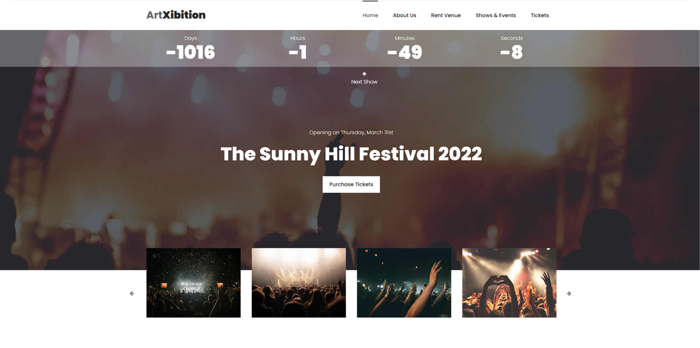

# Exhibition Art Platform - [Live](https://exhibition-art.netlify.app/)

Welcome to the Exhibition Art Platform project! This repository contains the code for my art exhibition platform web application.

## About the Project

The Exhibition Art Platform is a web application designed to showcase various artworks, providing a clean and interactive interface for users to explore different exhibitions and art pieces. It allows users to view the details of the artwork and get information about the exhibitions.

## Screenshot



## Features

- **🎨 Art Gallery**: Browse through a variety of art exhibitions, featuring a wide range of artworks.
- **🖼️ Artwork Details**: View detailed information about each artwork, including artist, title, and description.
- **🔍 Search & Filters**: Easily search for artworks by artist, style, or exhibition category.
- **📱 Responsive Design**: Optimized for seamless browsing across devices, from desktops to smartphones.

## Technologies Used

- **Frontend**: HTML, CSS, JavaScript
- **Hosting**: Netlify

## How to Use

1. Clone this repository:
   ```bash
   git clone https://github.com/yourusername/exhibition-art-platform.git
   ```
2. Navigate to the project directory:
   ```bash
   cd exhibition-art-platform
   ```
3. Install dependencies:
   ```bash
   npm install
   ```
4. Run the development server:
   ```bash
   npm start
   ```
5. Open your browser and visit:
   ```
   http://localhost:3000
   ```

## Deployment

This platform is hosted on Netlify. To deploy:
1. Link the repository to your Netlify account.
2. Push changes to the `main` branch, and Netlify will automatically deploy the updates.

---

Thank you for exploring my Exhibition Art Platform! If you find this project helpful, please give it a ⭐ to show your support.
